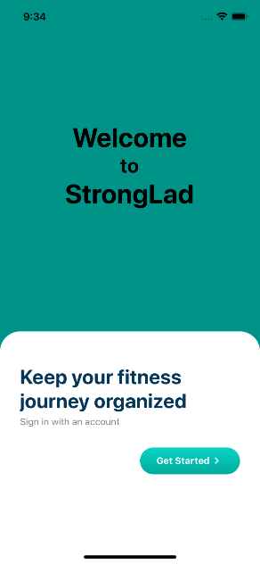
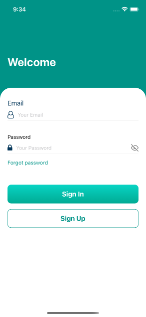
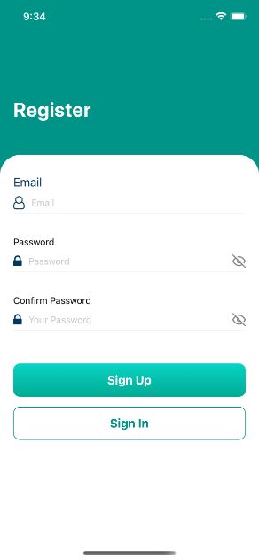
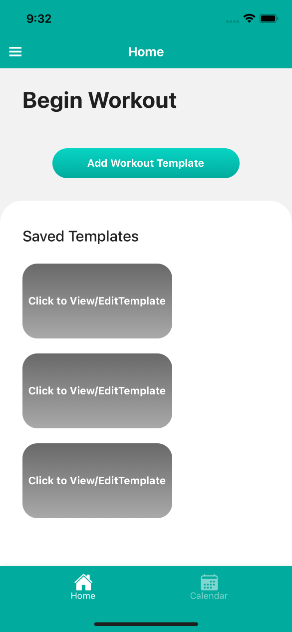
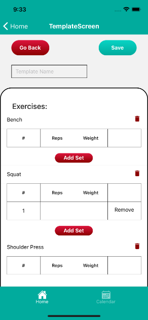
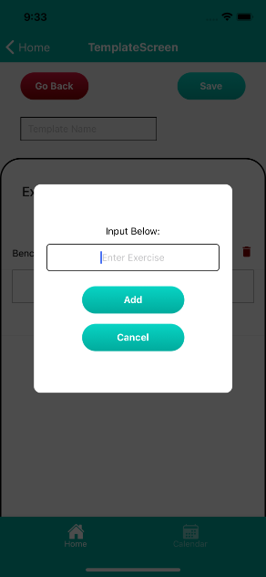

# StrongLad

This project was built with React Native, Firebase, and SQLite.

## Description

This ios application allows the user to keep track of their fitness journey by inputting and saving their workout routines wherever they go.

1. Sign in or sign up and create a user profile

2. Have the ability to save multiple templates for separate workouts during the week.

